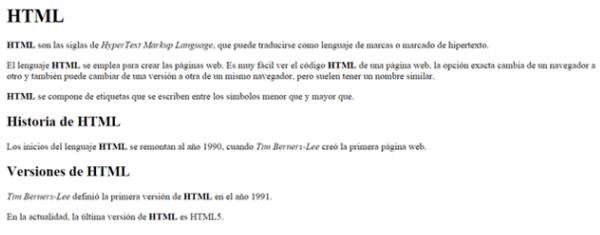

# Actividad Complementaria . Aula Virtual

_Esta es la Actividad complementaria de la Unidad 1 de HTML del curso de Front End Python dictado por Codo a Codo 2020_

_Se puede ver en vivo en_

* [Mirar en vivo](https://cac2020.vercel.app/Unidad_1/AC/indexAComplementaria.html)

## Actividad

Actividad complementaria HTML 1
En el código base que se te proporciona debes realizar los siguientes cambios:
* Las siglas HTML deben aparecer como texto destacado en toda la página.
* Tim Berners-Lee debe aparecer como texto enfatizado en toda la página.
* Debes añadir el siguiente contenido:
* Un encabezado de nivel 1 con el texto "HTML" antes de "HTML son las siglas de..."
* Un encabezado de nivel 2 con el texto "Historia de HTML" antes de "Los inicios del lenguaje HTML..."
* Un encabezado de nivel 2 con el texto "Versiones de HTML" antes de dos nuevos párrafos que contienen el texto "Tim Berners-Lee definió la primera versión de HTML en el año 1991" y "En la actualidad, la última versión de HTML es HTML5".
El resultado final debe ser una página web que tenga el mismo aspecto que la siguiente imagen:

---
por [ale87kb](https://github.com/ale87kb) 😊
